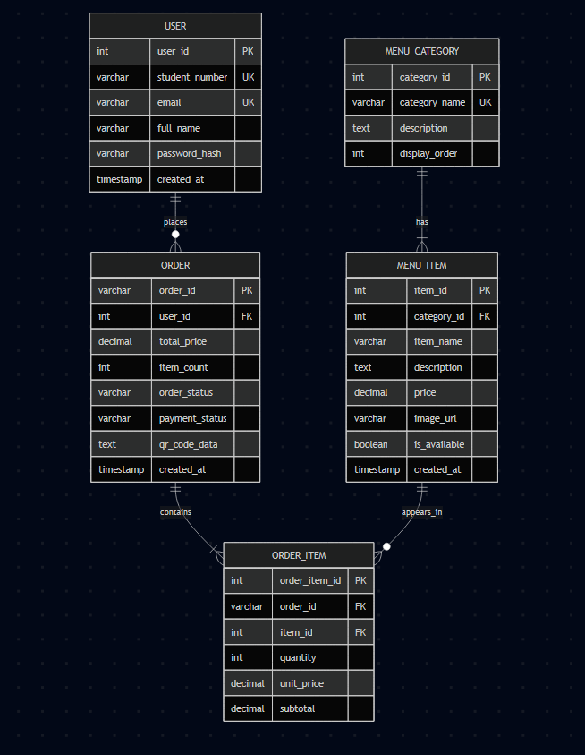
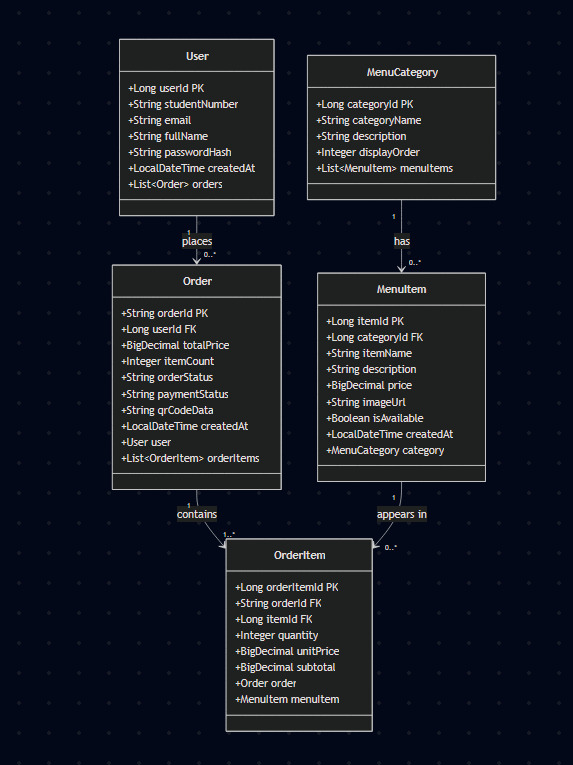

# IADE GO - Relatório Intermédio (2ª Entrega)

**Universidade:** [Universidade Europeia](https://www.europeia.pt/)  
**Faculdade:** [IADE - Faculdade de Design, Tecnologia e Comunicação](https://www.iade.europeia.pt/)  
**Repositório:** [IADE GO - GitHub](https://github.com/mimofixe/Projeto_3o_Semestre)  
**Curso:** Engenharia Informática  
**Data:** Novembro 2025

---

## Índice

1. [Elementos do Grupo](#elementos-do-grupo)
2. [Resumo](#resumo)
3. [Arquitetura do Sistema](#arquitetura-do-sistema)
4. [Modelo de Dados](#modelo-de-dados)
5. [API REST](#api-rest)
6. [Interface da Aplicação](#interface-da-aplicação)
7. [Tecnologias Utilizadas](#tecnologias-utilizadas)
8. [Próximos Passos](#próximos-passos)
9. [Conclusão](#conclusão)

---

## Elementos do Grupo

| Número | Nome |
|--------|------|
| 20230331 | David Bação | 
| 202301001 | Francisco Lourinho | 
| 20241805 | Vivandro Kambaza | 
| 20230853 | Yosvany Nunes | 

---

## 1. Resumo

### O que é o IADE GO?

**IADE GO** é uma aplicação móvel desenvolvida para otimizar a experiência dos estudantes no campus IADE, com foco principal em:

-  **Reserva de comida** no bar/cantina sem filas
-  **QR Code** para levantamento rápido de pedidos

### Estado Atual do Projeto

Nesta 2ª entrega, apresentamos:

 **Backend Spring Boot funcional** com API REST completa  
 **Base de dados MySQL** estruturada e populada com dados de exemplo  
 **Interface Android** desenvolvida em Kotlin + Jetpack Compose  
 **Documentação técnica** completa (Modelo de Dados, API REST, Diagramas)

---

## 2. Progresso do Desenvolvimento

### 2.1 Funcionalidades Implementadas

####  **Backend (100% Completo)**

**Sistema de Autenticação:**
- Registo de novos utilizadores
- Login com validação de credenciais
- Gestão de perfis de utilizador

**Gestão de Menu:**
- CRUD completo de categorias (Snacks, Refeições, Bebidas, Sobremesas)
- CRUD completo de produtos
- Listagem de produtos por categoria
- Controlo de disponibilidade de produtos

**Sistema de Encomendas:**
- Criação de encomendas com múltiplos produtos
- Cálculo automático de totais
- Geração de QR Code para validação
- Histórico de encomendas por utilizador
- Atualização de estados (PENDING → PREPARING → READY → COMPLETED)

####  **Base de Dados (100% Completa)**

**Estrutura:**
- 5 tabelas principais (users, menu_categories, menu_items, orders, order_items)
- Relações bem definidas entre entidades
- Constraints e validações implementadas
- Índices para otimização de queries

**Dados de Exemplo:**
- 2 utilizadores de teste
- 4 categorias de menu
- 12 produtos disponíveis
- 1 encomenda de exemplo com 3 itens

#### **Interface Android (60% Completo)**

**Ecrãs Desenvolvidos:**
-  Splash Screen
-  Login / Registo
-  Menu Principal
-  Menu da Cafetaria (com categorias e produtos)
-  Carrinho de Compras
-  Perfil do Utilizador
-  Mapa IADE (em desenvolvimento)
-  QR Code Display (em desenvolvimento)

---

## 3. Arquitetura do Sistema

### 3.1 Visão Geral
```

                  CAMADA APRESENTAÇÃO                    
             App Android (Kotlin + Compose)              

                     │ HTTP/REST
                     │
                     v
                   CAMADA NEGÓCIO
                      
              Backend (Spring Boot - Java)                
    
         Controllers     Repositories      Entities

                     |
                     |
                     |
                     │ JPA/Hibernate
                     │
                     v
                   CAMADA DADOS                           
              Base de Dados (MySQL 8.0)                   

```

### 3.2 Componentes Principais

#### **App Android**
- **Linguagem:** Kotlin
- **UI Framework:** Jetpack Compose
- **Arquitetura:** MVVM (Model-View-ViewModel)
- **Navegação:** Compose Navigation

#### **Backend Spring Boot**
- **Linguagem:** Java 17
- **Framework:** Spring Boot 3.x
- **Persistência:** JPA/Hibernate
- **API:** REST (JSON)

#### **Base de Dados**
- **SGBD:** MySQL 8.0
- **Gestão:** XAMPP
- **Charset:** UTF-8
- **Collation:** utf8mb4_unicode_ci

---

## 4. Modelo de Dados

### 4.1 Diagrama Entidade-Relação



### 4.2 Entidades Principais

#### **User (Utilizador)**
Armazena informação dos utilizadores do sistema.

**Campos:**
- `user_id` (PK) - Identificador único
- `student_number` - Número de estudante IADE
- `email` - Email institucional (único)
- `full_name` - Nome completo
- `password_hash` - Password encriptada (bcrypt)
- `created_at` - Data de criação da conta

**Relações:**
- 1 User → N Orders (Um utilizador pode ter múltiplas encomendas)

---

#### **MenuCategory (Categoria de Menu)**
Organiza os produtos em categorias.

**Campos:**
- `category_id` (PK) - Identificador único
- `category_name` - Nome da categoria (ex: Snacks, Meals)
- `description` - Descrição da categoria
- `display_order` - Ordem de apresentação

**Categorias Implementadas:**
1. Snacks - Lanches rápidos
2. Meals - Refeições completas
3. Beverages - Bebidas
4. Desserts - Sobremesas

**Relações:**
- 1 Category → N MenuItems (Uma categoria contém múltiplos produtos)

---

#### **MenuItem (Produto do Menu)**
Produtos disponíveis para encomenda.

**Campos:**
- `item_id` (PK) - Identificador único
- `category_id` (FK) - Referência à categoria
- `item_name` - Nome do produto
- `description` - Descrição detalhada
- `price` - Preço em euros (ex: 2.50)
- `image_url` - Nome do ficheiro de imagem
- `is_available` - Disponibilidade (TRUE/FALSE)
- `created_at` - Data de criação

**Exemplos de Produtos:**
- Cookies (€1.50)
- Croissant (€1.80)
- Tosta Mista (€2.50)
- Café (€0.70)
- Pastel de Nata (€1.30)

**Relações:**
- N MenuItem → 1 Category (Muitos produtos pertencem a uma categoria)
- 1 MenuItem → N OrderItems (Um produto pode aparecer em várias encomendas)

---

#### **Order (Encomenda)**
Encomendas realizadas pelos utilizadores.

**Campos:**
- `order_id` (PK) - Código único (ex: ORD1737334000ABCD)
- `user_id` (FK) - Referência ao utilizador
- `total_price` - Preço total da encomenda
- `item_count` - Quantidade total de itens
- `order_status` - Estado da encomenda
- `payment_status` - Estado do pagamento
- `qr_code_data` - Dados do QR Code (JSON)
- `created_at` - Data/hora de criação

**Estados da Encomenda:**
- `PENDING` - Aguardando processamento
- `PAID` - Pagamento confirmado
- `PREPARING` - Em preparação
- `READY` - Pronta para levantamento
- `COMPLETED` - Encomenda concluída
- `CANCELLED` - Cancelada

**Estados do Pagamento:**
- `PENDING` - Pagamento pendente
- `PAID` - Pagamento confirmado
- `FAILED` - Pagamento falhou

**Relações:**
- N Orders → 1 User (Muitas encomendas pertencem a um utilizador)
- 1 Order → N OrderItems (Uma encomenda contém múltiplos itens)

---

#### **OrderItem (Item da Encomenda)**
Produtos individuais dentro de cada encomenda.

**Campos:**
- `order_item_id` (PK) - Identificador único
- `order_id` (FK) - Referência à encomenda
- `item_id` (FK) - Referência ao produto
- `quantity` - Quantidade do produto
- `unit_price` - Preço unitário (no momento da compra)
- `subtotal` - Subtotal (quantity × unit_price)

**Relações:**
- N OrderItems → 1 Order (Muitos itens pertencem a uma encomenda)
- N OrderItems → 1 MenuItem (Muitos itens referenciam um produto)

---

### 4.3 Diagrama de Classes



*Ver ficheiro `class-diagram.md` para código Mermaid/PlantUML*

---

## 5. API REST

### 5.1 Visão Geral

**Base URL:** `http://localhost:8081`  
**Formato:** JSON  
**Autenticação:** Em desenvolvimento (futuro: JWT)

### 5.2 Endpoints Implementados

#### **Autenticação**

| Método | Endpoint | Descrição |
|--------|----------|-----------|
| POST | `/api/auth/register` | Registar novo utilizador |
| POST | `/api/auth/login` | Fazer login |
| GET | `/api/auth/users/{id}` | Ver perfil do utilizador |

**Exemplo - Login:**
```json
POST /api/auth/login
{
  "email": "joao.silva@iade.pt",
  "password": "password123"
}

Response (200 OK):
{
  "userId": 1,
  "email": "joao.silva@iade.pt",
  "fullName": "João Silva",
  "studentNumber": "20240001",
  "message": "Login successful"
}
```

---

#### **Menu**

| Método | Endpoint | Descrição |
|--------|----------|-----------|
| GET | `/api/menu/categories` | Listar categorias |
| GET | `/api/menu/items` | Listar todos os produtos |
| GET | `/api/menu/items/category/{id}` | Produtos por categoria |
| POST | `/api/menu/items` | Criar novo produto |
| PUT | `/api/menu/items/{id}` | Atualizar produto |
| DELETE | `/api/menu/items/{id}` | Apagar produto |

**Exemplo - Listar Produtos:**
```json
GET /api/menu/items

Response (200 OK):
[
  {
    "itemId": 1,
    "itemName": "Cookies",
    "description": "Chocolate chip cookies (3 units)",
    "price": 1.50,
    "imageUrl": "cookies.jpg",
    "isAvailable": true
  },
  {
    "itemId": 2,
    "itemName": "Croissant",
    "description": "Butter croissant",
    "price": 1.80,
    "imageUrl": "croissant.jpg",
    "isAvailable": true
  }
]
```

---

#### **Encomendas**

| Método | Endpoint | Descrição |
|--------|----------|-----------|
| POST | `/api/orders` | Criar encomenda |
| GET | `/api/orders/{orderId}` | Ver encomenda |
| GET | `/api/orders/user/{userId}` | Histórico do utilizador |
| PATCH | `/api/orders/{orderId}/status` | Atualizar estado |

**Exemplo - Criar Encomenda:**
```json
POST /api/orders
{
  "userId": 1,
  "items": [
    { "itemId": 1, "quantity": 2 },
    { "itemId": 7, "quantity": 1 }
  ],
  "paymentMethod": "PAY_NOW"
}

Response (201 Created):
{
  "orderId": "ORD1737334000ABCD",
  "userId": 1,
  "userName": "João Silva",
  "totalPrice": 3.70,
  "itemCount": 3,
  "orderStatus": "PENDING",
  "paymentStatus": "PAID",
  "qrCodeData": "{...}",
  "createdAt": "2025-01-19T10:30:00",
  "items": [
    {
      "itemId": 1,
      "itemName": "Cookies",
      "quantity": 2,
      "unitPrice": 1.50,
      "subtotal": 3.00
    },
    {
      "itemId": 7,
      "itemName": "Café",
      "quantity": 1,
      "unitPrice": 0.70,
      "subtotal": 0.70
    }
  ]
}
```

*Ver documentação completa em `rest-api-complete.md`*

---

## 6. Interface da Aplicação

### 6.1 Design System

**Cores Principais:**
- Primário: Azul IADE (#1976D2)
- Secundário: Verde (#4CAF50)
- Fundo: Branco / Cinza Claro
- Texto: Preto / Cinza Escuro

**Tipografia:**
- Títulos: Roboto Bold
- Corpo: Roboto Regular
- Tamanhos: 12sp - 24sp

### 6.2 Ecrãs Principais

#### **1. Login**
- Input de email e password
- Botão "Entrar"
- Link para registo

#### **2. Menu Principal**
- Grid com 4 opções:
  -  Cafetaria
  -  Mapa IADE

#### **3. Menu Cafetaria**
- Tabs para categorias (Snacks, Meals, Beverages, Desserts)
- Cards de produtos com:
  - Imagem
  - Nome
  - Descrição
  - Preço
  - Botão "Adicionar ao Carrinho"

#### **4. Carrinho de Compras**
- Lista de produtos selecionados
- Quantidade editável
- Total
- Botões:
  - "Pagar Agora"
  - "Pagar ao Levantar"

#### **5. QR Code** (Em desenvolvimento)
- Display do QR Code
- Timer de 10 minutos
- Detalhes da encomenda

---

## 7. Tecnologias Utilizadas

### 7.1 Frontend (App Android)

| Tecnologia | Versão | Uso |
|------------|--------|-----|
| Kotlin | 1.9+ | Linguagem principal |
| Jetpack Compose | 1.5+ | UI Framework |
| Material Design 3 | Latest | Design System |
| Compose Navigation | Latest | Navegação entre ecrãs |
| Retrofit | 2.9+ | HTTP Client (futuro) |

### 7.2 Backend

| Tecnologia | Versão | Uso |
|------------|--------|-----|
| Java | 17 | Linguagem principal |
| Spring Boot | 3.2+ | Framework backend |
| Spring Data JPA | 3.2+ | Persistência de dados |
| Hibernate | 6.x | ORM |
| MySQL Connector | 8.x | Driver JDBC |

### 7.3 Base de Dados

| Tecnologia | Versão | Uso |
|------------|--------|-----|
| MySQL | 8.0 | SGBD |
| XAMPP | 8.x | Ambiente local |

### 7.4 Ferramentas

| Ferramenta | Uso |
|------------|-----|
| IntelliJ IDEA | IDE Backend |
| Android Studio | IDE App |
| Postman | Testes API |
| Git + GitHub | Controlo de versões |
| Figma | Design UI/UX |
| ClickUp | Gestão de projeto |


## 8. Próximos Passos

### 8.1 Para a Entrega Final (Semana 13)

#### **Alta Prioridade** 

- [ ] **Integração completa App ↔ Backend**
  - Implementar Retrofit no Android
  - Conectar todos os ecrãs à API
  - Testar fluxo completo de encomenda

- [ ] **Sistema de QR Code**
  - Gerar QR Code no backend
  - Display na app
  - Validação pelo staff

- [ ] **Testes Completos**
  - Testes unitários (backend)
  - Testes de integração
  - Testes de UI (Android)

#### **Média Prioridade** 

- [ ] **Mapa IADE**
  - GPS interno
  - Localização de salas
  - Rotas

- [ ] **Notificações Push**
  - Encomenda pronta
  - Lembretes

- [ ] **Melhorias de UI/UX**
  - Animações
  - Loading states
  - Error handling

#### **Baixa Prioridade**

- [ ] **Funcionalidades Extra**
  - Reserva de salas
  - Histórico detalhado
  - Avaliação de produtos

---

## 9. Conclusão

### 9.1 Resumo do Progresso

Nesta 2ª fase do projeto, conseguimos implementar com sucesso:

**Backend robusto e funcional** com 15+ endpoints REST  
**Base de dados bem estruturada** com 5 tabelas e relações corretas  
**Interface Android moderna** utilizando Jetpack Compose  
**Documentação técnica completa** (ER Diagram, Class Diagram, API Docs, Data Dictionary)

**Progresso Geral: ~75%**

---

### 9.2 Contribuições da Equipa

| Membro | Responsabilidade Principal |
|--------|---------------------------|
| David Bação | Backend (Spring Boot) + Base de Dados + MD |
| Francisco Lourinho | Frontend (Android) + Suporte Backend + MD |
| Vivandro Kambaza | Apresentação e MD |
| Yosvany Nunes | Documentação + Gestão de Projeto |

---

### 9.3 Perspetivas Futuras

O **IADE GO** tem potencial para:

**Expansão de funcionalidades:**
- Sistema de pontos/recompensas
- Integração com cartão de estudante
- Sugestões personalizadas baseadas em histórico

**Escalabilidade:**
- Expansão para outros campi UE
- Versão iOS
- Portal web para staff

**Impacto:**
- Redução de tempo em filas
- Melhor gestão de recursos do bar
- Experiência do estudante otimizada

---

## Bibliografia

### Documentação Técnica

- [Spring Boot Documentation](https://spring.io/projects/spring-boot)
- [Kotlin Language Reference](https://kotlinlang.org/docs/reference/)
- [Jetpack Compose Documentation](https://developer.android.com/jetpack/compose)
- [MySQL 8.0 Reference Manual](https://dev.mysql.com/doc/refman/8.0/en/)

### Ferramentas

- [IntelliJ IDEA](https://www.jetbrains.com/idea/)
- [Android Studio](https://developer.android.com/studio)
- [Postman](https://www.postman.com/)
- [Figma](https://www.figma.com/)
- [ClickUp](https://clickup.com/)


### B. Links Úteis

- **Repositório GitHub:** https://github.com/mimofixe/Projeto_3o_Semestre
- **Gestão de Projeto:** https://app.clickup.com/t/86c5nymvw
---

**Fim do Relatório Intermédio**
